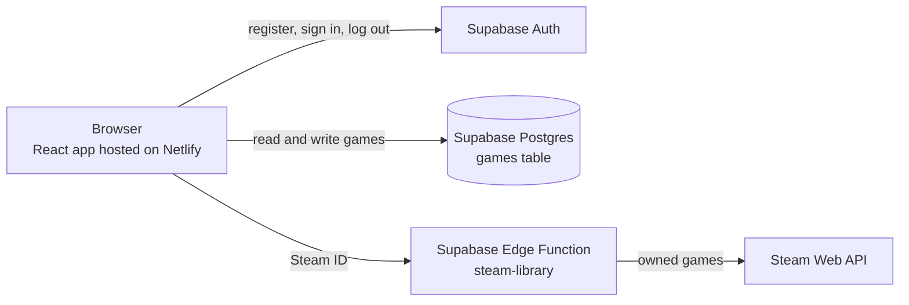

# Steam Campaign Tracker

A web app that receives a list of purchased titles in a user's Steam library, and the user can manually checkmark or cross off games in their library that have a campaign/story and have been completed (similar to a movie watchlist).

- **Live app:** _link added after deployment_
- **Demo video:** _link added after recording_

## What the app does

- **Accounts.** Register, sign in and log out with an email and password. Every library is private to its owner.
- **Steam import.** Enter a Steam ID, profile link or custom profile name and the app pulls in every game that account owns, with playtime. Importing again adds new purchases and refreshes playtime without touching your statuses or notes.
- **Manual entries.** Add games that are not on Steam by typing a title.
- **Track campaigns.** Tick a game to cross it off as completed, or set its status to Not started, Playing, Completed or No campaign. Add a note, rename a game or delete it.
- **Games with no campaign.** MMOs, battle royales and other games with no story can be marked "No campaign" so they do not count against your progress. Any game can also be hidden from the list and brought back with "Show hidden games".
- **Find things.** Search by title, filter by status and sort by title or by most played.
- **Progress.** A percentage and progress bar show how many of your campaigns are finished.

## How it works



- The browser talks to Supabase directly for sign-in and for reading and writing games. Row-level security in the database makes sure each request only reaches the signed-in user's own rows.
- The Steam Web API needs a secret key and does not accept requests from browsers, so the import goes through an Edge Function. The function checks that the caller is signed in, asks Steam for the owned games and returns the list. The key never leaves the server.

## Technologies used

| Part | Technology |
| --- | --- |
| Frontend | React 19, built with Vite |
| Database | Supabase (Postgres) with row-level security |
| Authentication | Supabase Auth (email and password) |
| Steam import | Supabase Edge Function (Deno, TypeScript) calling the Steam Web API |
| Hosting | Netlify |
| Version control | Git and GitHub |

## Project structure

```text
steam-campaign-tracker/
├── index.html                    Page shell that loads the React app
├── netlify.toml                  Build settings for Netlify
├── .env.example                  Template for the two Supabase settings
├── public/
│   └── favicon.svg
├── src/
│   ├── main.jsx                  Starts React
│   ├── App.jsx                   Shows the sign-in page or the library
│   ├── index.css                 All styles
│   ├── hooks/
│   │   └── useSession.js         Keeps track of who is signed in
│   ├── lib/
│   │   ├── supabaseClient.js     The one Supabase client the app shares
│   │   ├── gamesApi.js           Every database call: list, add, update, delete, import
│   │   ├── steamApi.js           Calls the steam-library Edge Function
│   │   ├── libraryView.js        Filtering, sorting and progress calculations
│   │   └── statuses.js           The four campaign statuses
│   └── components/
│       ├── Intro.jsx             What the app is for (sign-in page)
│       ├── AuthForm.jsx          Sign in and register form
│       ├── SetupNotice.jsx       Shown when .env is missing
│       ├── Library.jsx           The library screen and its state
│       ├── LibraryStats.jsx      Progress percentage and bar
│       ├── SteamImport.jsx       Import from Steam form
│       ├── AddGameForm.jsx       Add a game by hand
│       ├── LibraryFilters.jsx    Search, status buttons, sort, show hidden
│       └── GameRow.jsx           One game: checkbox, status, edit, hide, delete
└── supabase/
    ├── migrations/
    │   └── 001_create_games.sql  Table, row-level security and access grants
    └── functions/
        └── steam-library/
            └── index.ts          Edge Function that talks to Steam
```

## Data model

One table, `games`, with one row per game per user:

| Field | Type | Notes |
| --- | --- | --- |
| `id` | uuid | Primary key |
| `user_id` | uuid | Owner of the row, filled in by the database with the signed-in user |
| `steam_appid` | integer | Steam's ID for the game; empty for games added by hand |
| `title` | text | Game name |
| `playtime_minutes` | integer | Reported by Steam on import |
| `status` | text | `not_started`, `playing`, `completed` or `no_campaign` |
| `hidden` | boolean | Hidden games are left out of the default list and of the progress figure |
| `notes` | text | Optional personal note |
| `created_at`, `updated_at` | timestamp | Set automatically |

A user can hold each Steam game only once (`user_id` + `steam_appid` is unique), which is what lets a re-import update rows instead of duplicating them.

## Setup instructions

Requires [Node.js](https://nodejs.org) 20.19 or newer, a free [Supabase](https://supabase.com) project and a free [Steam Web API key](https://steamcommunity.com/dev/apikey).

1. Clone the repository and install the dependencies:

   ```bash
   git clone https://github.com/TechnoSpark-developer/steam-campaign-tracker.git
   cd steam-campaign-tracker
   npm install
   ```

2. Create the database table. In the Supabase dashboard open **SQL Editor**, paste the contents of [`supabase/migrations/001_create_games.sql`](supabase/migrations/001_create_games.sql) and run it. The script creates the `games` table, turns on row-level security and grants access to signed-in users only.

3. Allow instant sign-up. In the Supabase dashboard go to **Authentication > Sign In / Providers > Email** and turn **Confirm email** off. Supabase's built-in mailer only delivers to members of the project's own team, so with confirmation on nobody else could finish registering.

4. Deploy the Steam import function. In the Supabase dashboard open **Edge Functions > Deploy a new function > Via Editor**, name it `steam-library`, paste the contents of [`supabase/functions/steam-library/index.ts`](supabase/functions/steam-library/index.ts) and deploy. Then, under **Edge Functions > Secrets**, add a secret named `STEAM_API_KEY` holding your Steam Web API key.

5. Copy `.env.example` to `.env` and fill in your project's URL and publishable key (Supabase dashboard > **Connect**).

6. Start the dev server:

   ```bash
   npm run dev
   ```

   Then open the address Vite prints, usually <http://localhost:5173>.

To import a library, the Steam profile's **Game details** must be set to Public (Steam > Profile > Edit Profile > Privacy Settings).

### Deploying to Netlify

1. In Netlify choose **Add new project > Import an existing project** and pick this repository. The build command (`npm run build`) and publish directory (`dist`) are read from [`netlify.toml`](netlify.toml).
2. Add two environment variables with the same values as in `.env`: `VITE_SUPABASE_URL` and `VITE_SUPABASE_PUBLISHABLE_KEY`. Do not mark them as secret, because they are built into the public page on purpose.
3. Deploy, then set **Project configuration > General > Visitor access > Project visibility** to **Public** so anyone with the link can open the app.

## Security

- **Row-level security.** Every query runs as the signed-in user, and the database policies only let a user see, add, change or delete rows where `user_id` is their own. Visitors who are not signed in have no access to the table at all.
- **No secrets in the browser.** The only values shipped to the browser are the Supabase URL and publishable key, which are designed to be public. The Steam API key is stored as a Supabase secret and is only used inside the Edge Function.
- **No secrets in the repository.** `.env` is ignored by Git; `.env.example` holds placeholders only.

## How it was built

This project was built for EGN 4952C (Engineering Design 2) as an exercise in directing an AI coding assistant. I used Claude to generate the code one milestone at a time. I wrote the spec, ran and tested each milestone locally against my own Supabase project, and committed after each one, so the commit history follows the order below.

- [x] Project spec
- [x] React + Vite scaffold
- [x] Supabase table and row-level security
- [x] Register, log in, log out
- [x] Library: add, view, change status, delete
- [x] Steam library import
- [x] Filters, hide/show, search and progress stats
- [ ] Deploy to Netlify, demo video
